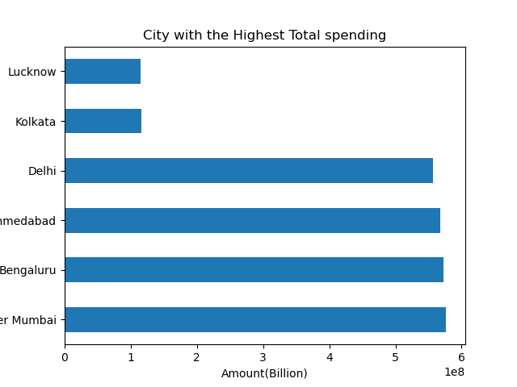
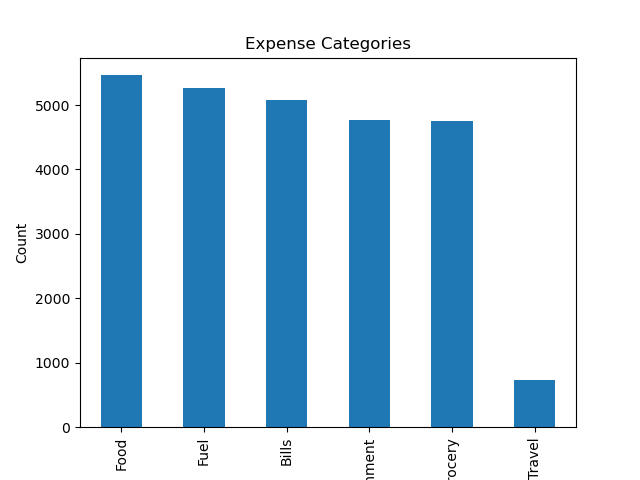

# 💳 Credit Card Spending Analysis

## 📌 Project Goal
Analyze credit card transaction data to uncover spending patterns across cities, genders, and expense types.

## 🧰 Tools Used
- Python
- Pandas, Matplotlib, Seaborn
- Jupyter Notebook

## 📂 Dataset
- Simulated credit card transaction dataset
- Features include City, Gender, Expense Type, Card Type and Date.

## 🔍 Key Questions Answered
- Which cities have the highest total spending?
- What are the most common expense types?
- How do spending patterns differ by gender and city?

## 🔍 Summary of Insights
- **Food** is the most frequent expense category across cities and genders.
- **Females** spend more in total and make higher single transactions than males.
- **Greater Mumbai** leads in total spending; **Bengaluru** has the highest number of transactions.
- In top cities, **Food** remains the most common expense type.
- Gender spending patterns vary slightly by city but show overall female dominance in spend volume.

## 📌 Business Recommendation
Financial institutions and marketing teams can use these insights to:
- Focus campaigns on food-related benefits and offers.
- Target high-spending cities like Greater Mumbai with premium card features.
- Consider gender-focused financial products, especially for urban female consumers.

## 📊 Sample Visualizations

### Top 5 Cities by Total Spending

### Expense Type Distribution

## 🧠 Skills Demonstrated
- Data cleaning and manipulation with Pandas
- Grouping, filtering, and summarizing data
- Data visualization with Matplotlib and Seaborn
- Business insight generation and communication

## ✅ Conclusion
This project demonstrates real-world business analysis using Python. It helped develop my EDA and storytelling skills while translating raw data into actionable recommendations.

